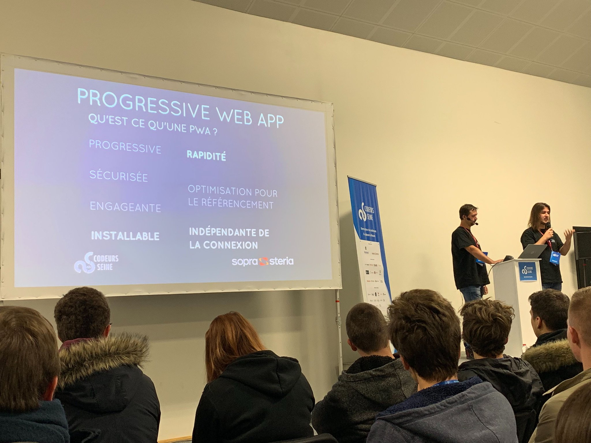

# Résumé de la conférence "Angular & PWA : Mon site survit à l’apocalypse !"

## Cartouche d'identification

 - Manifestation : CodeursEnSeine 2018
 - Lieu : Kindarena Rouen
 - Conférence : Angular & PWA : Mon site survit à l’apocalypse !
 - Horaire de la conférence : 14h10 - 14h30
 - Durée de la conférence : 20min
 - Conférencier(s) :
   - Cyril Lefebvre : https://www.linkedin.com/in/cyril-lefebvre-2a818294/?originalSubdomain=fr
   - Frédéric Jammes : https://www.linkedin.com/in/fr%C3%A9d%C3%A9ric-jammes-b2991331/
 - Audience : Environ 100 participants
 - Auteur du billet : François BRUN
 - Mots-clés : Angular, PWA, Application, Apocalypse, Survie, Rapide, Installable, Fiable
 - Illustration : 

## Support
 - Lien vers le support (diapos) présenté en conférence : https://www.youtube.com/channel/UCWujmG5rANxJI0nHbMFs08w/videos
 - Nombre de diapos du support : 14
 - Plan du support :
   - Intro
   - Mise en contexte
   - Présentation de l'architecture utilisée
   - Démonstration
   - Présentation des avantages des PWA
   - Conclusion

## Résumé
200 mots (~16 lignes) :

L'apocalypse est arrivée, que faire ? Les conférenciers répondent à cette question simplement : il nous faut un site web pour continuer à informer les gens et leur proposer des guides de survie ! Le cahier des charges est simple : il faut que ce site soit rapide à mettre en oeuvre et qu'il soit fiable. Ainsi, même en cas de coupure Internet, il faut que les utilisateurs puissent continuer à utiliser l'application. La solution que présente cette conférence pour répondre à ce cahier des charges : une application Angular en Progressive Web App (PWA).

## Architecture et facteur qualité
Reliability (fiabilité) 
